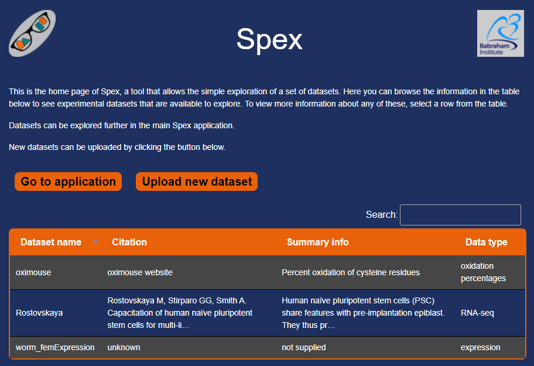

# spex home
## Home page for spex application

The main spex page is a shiny application that allows simple exploration of datasets.  
The [home page](https://www.bioinformatics.babraham.ac.uk/spex/spex_home.html) shows the available datasets. It only uses html, javascript and css, so is fast to load and use.   
It links through to the main app, and also a separate app that allows the upload of new datasets.

